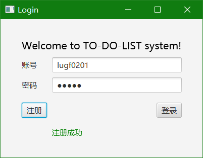
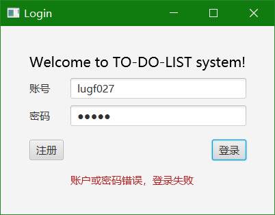
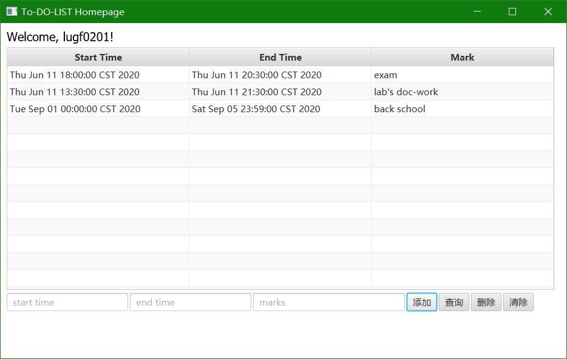

# WHU-TO_DO_LIST 

## 基于Java+CORBA构建的分布式待办事项列表系统。

**武汉大学计算机学院2017级-2020学年春季网络及分布式实验**

运行环境**

操作系统：Windows 10

所用语言：JDK8

IDE: IntelliJ IDEA 2019.2.4 (Ultimate Edition)

引用依赖：fastjson-1.1.36.jar

**orbd** jdk自带了

  在命令行终端运行-> start orbd -ORBInitialPort 1050 -ORBInitialHost localhost

**server** 

在IDEA中导入ToDoListServer项目，并运行src/server/ToDoListServer.

java中main方法。

**client** JavaFX项目

  在IDEA中导入Client项目，并运行src/sample/Main.Java中main方法。

**运行结果**

* 注册

* 登录

* 主页面

